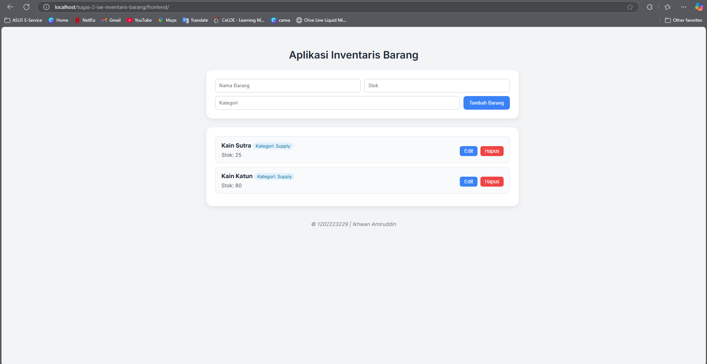
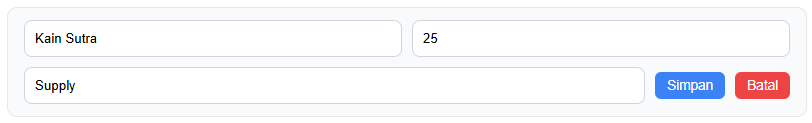
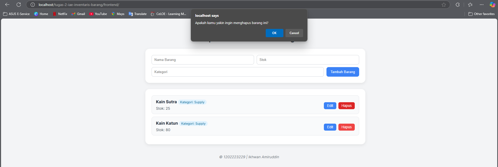

# Tugas 2 - Inventaris Barang CRUD API

## 📌 Deskripsi Aplikasi
Aplikasi **Inventaris Barang** adalah aplikasi web sederhana yang menerapkan konsep **CRUD API**

Aplikasi ini memungkinkan pengguna untuk:

- Menambahkan barang baru ke inventaris (**POST**)
- Menampilkan daftar barang yang tersimpan (**GET**)
- Mengedit data barang (**PUT**)
- Menghapus barang dari daftar (**DELETE**)

---

## Teknologi yang Digunakan

### Backend
- **Python 3** – Bahasa pemrograman utama
- **Flask** – Framework backend ringan untuk REST API
- **Flask-CORS** – Mengizinkan akses API dari frontend (Cross-Origin)
- **JSON** – Format pertukaran data antara frontend dan backend
- **(Opsional)** SQLite / MySQL – Penyimpanan data backend

### Frontend
- **HTML5** – Struktur dasar halaman
- **CSS3** – Styling halaman aplikasi
- **JavaScript (Vanilla)** – Untuk memproses data dan memanggil API
- **Fetch API** – Native JS method untuk request HTTP

---

## Endpoint API

| Method | Endpoint               | Deskripsi                                |
|--------|------------------------|------------------------------------------|
| GET    | `/api/inventory`       | Menampilkan semua barang di inventaris   |
| POST   | `/api/inventory`       | Menambahkan barang baru ke inventaris    |
| PUT    | `/api/inventory/<id>`  | Mengubah data barang berdasarkan ID      |
| DELETE | `/api/inventory/<id>`  | Menghapus data barang berdasarkan ID     |

---

## Cara Menjalankan Aplikasi

### 1. Menjalankan Backend
1. Install `Flask` dan `flask-cors`  
   command: pip install flask flask-cors

2. Masuk ke direktori backend dan jalankan server
   command: python app.py

3. Server akan aktif di:
   http://localhost:5000

### 2. Menjalankan Frontend
1. Buka folder frontend/
2. Jalankan file index.html di browser (klik dua kali atau pakai Live Server)
3. Pastikan backend sudah aktif, agar Fetch API bisa mengambil data dari server

---

## 👨‍💻 Perancang
- Nama: Ikhwan Amiruddin
- NIM: 1202223229
- Kelas: SI-46-02

---

## 📸 Screenshot
### 1. Tampilan Aplikasi

### 2. Tampilan Edit

### 3. Tampilan Delete
